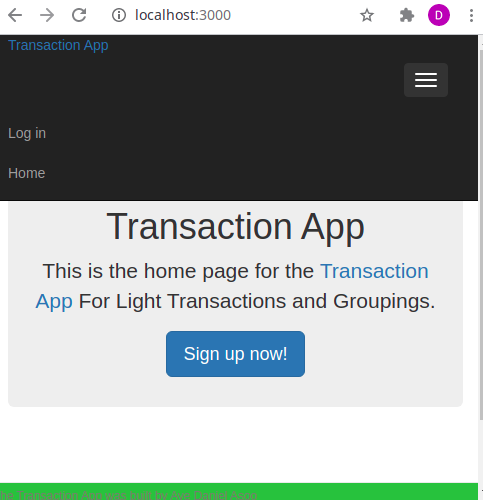

# README

This is the capstone project of the Microverse Ruby on Rails curriculum. It is built with the MVP approach. .This project has the following features:

- Users can create an account with a username and login, name and email

- Users can create a group for trading

- Users can create a trading for single and multiple groups

- Users can create a trading without a group

- Users can create, edit and delete .

## Description:

### After log in a user can see:

- All my transactions.
- All my external transactions.
- All groups..

### When user opens "All My Transaction Amount Page" :

- The group name is displayed.
- Total amount is displayed according to grouped.
- A list of all transactions created by logged-in user is displayed (sorted by most recent).
- Each expense displays its name, amount and date, and an icon of the group; if it has been assigned to.
- An action button "Create new Transaction" is displayed.

### When user opens "All groups" page:

- A list of all groups is displayed in alphabetical order.
- Each group displays its icon and name.
- An action button "New Group" is displayed.

## Live Demo

- [Live Demo Link](https://ayerorcapstone.herokuapp.com/) -[Video](https://ayerorcapstone.herokuapp.com/)
  -While testing the live app, it is expected that the tester test the applications with pictures at his end because this app is hosted on heroku without subscription, hence once the dyno is down the images would not display, except it is fired up. So kindly help upload group images of your choice while carrying out the testing.

## Built With

- Rails
- Ruby
- HTML
- CSS
- ERB
- Bootstrap
- Rspec

### Prerequisites

- Ruby: 2.7.1
- Rails: 6.1.0

### Install and Setup

- Clone repo to your local `git@github.com:Alaska01/Transact.git`
- cd into the cloned repo
- Open a terminal in the root of the app
- Run `yarn install --check-files`
- Run `bundle install`
- Run `rails db:reset`
- Run `rails db:migrate`
- Run Start up you server with `rails s`
- Open http://localhost:3000/ in your browser.
- You may need to delete your gem lock file and run the command `bundle install`
  -Depending on your OS and ruby version manager, you may need to follow the prompt or request your browser may be showing you to handle system perculiar issues.

### Testing

- Open a terminal and run `rspec`.

## Author

👤 **Aye Daniel Asoo**

- Github: [Github](https://github.com/Alaska01)
- Twitter: [Twitter](https://twitter.com/AyeAsoo)
- E-mail: <a href="mailto:aadaniel108@gmail.com?subject=Hello Daniel!">Email</a>
- Linkedin: [Linkedin](https://www.linkedin.com/in/daniel-asoo-aye/)

## 🤝 Contributing

Contributions, issues and feature requests are welcome!

## Show your support

Give a ⭐️ if you like this project!

## Acknowledgments

- Microverse
- Stack-overflow
  [Design By: Gregoire Vella on Behance](https://www.behance.net/gallery/19759151/Snapscan-iOs-design-and-branding?tracking_source=).

## 📝 License
